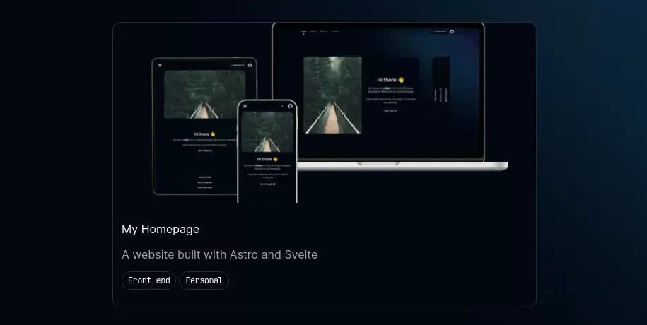

import AstroLogo from "icons:astro/logos/astro-icon";
import SvelteLogo from "icons:astro/logos/svelte-icon";
import TypeScriptLogo from "icons:astro/logos/typescript-icon";
import VercelLogo from "icons:astro/logos/vercel";
import TailwindLogo from "icons:astro/logos/tailwindcss-icon"
import ExternalLinkIcon from "icons:astro/heroicons/arrow-top-right-on-square";
import AppLink from "@components/AppLink.astro";

  <AppLink as="a" appearance="secondary" href="https://github.com/Trombach/astro-homepage" class="w-fit no-underline">
    View Repository
    <ExternalLinkIcon />
  </AppLink>

## Built with

  <AstroLogo class="fill-foreground" />
  <SvelteLogo />
  <TypeScriptLogo />
  <VercelLogo class="fill-foreground" />

## Quick Facts

- mostly static build for easy caching and fast page load speeds
- uses Astro's content collections and MDX for serving content
- takes advantage of `ViewTransitions` API for smoother page transitions
- complex interactivity powered by Svelte components

## Why Astro?

I came across the Astro framework while investigating possible front-end frameworks for a marketing website. I was
immediately drawn in by its simplicity and the ability to write components in different framework languages. By default
Astro compiles everything in static HTML which can be hydrated on the client, but it can also be used for server-side
rendering using adapters.

The flexibility and ease of use made it the perfect choice for my homepage.

## Why Svelte?

Svelte is on of my favourite front-end frameworks to work with. Besides the fact that it is blazingly fast, it also
comes with some great utility functions for building smooth animations, which can be seen on the <a href="/">Hero
page</a>.

Svelte also features a very powerful reactivity model that is very easy to use. While it would have been possible to
build a reactive component with plain Astro components, Svelte brings some additional quality of life improvements to
the table like stores. 

To me Svelte and Astro are a perfect match, combining a powerful reactive framework with an easy to use static-site
renderer.

## Animations

I think animations are important for websites and apps to feel natural to whoever is interacting with them. As humans we
are used to being able to manipulate things with our actions, so if we're not able to achieve this the experience can be
jarring. Here are some of the animations I added to make the page feel more natural.

### Plain CSS

### Astro [`ViewTransitions`](https://docs.astro.build/en/guides/view-transitions/)

<figure>
  
  <figcaption>An animation spanning page renders using Astro view transitions.</figcaption>
</figure>

### Svelte [`transition`](https://svelte.dev/docs/svelte-transition)

<figure>
  
  <figcaption>The card content is smoothly faded in using Svelte's `blur` transition.</figcaption>
</figure>